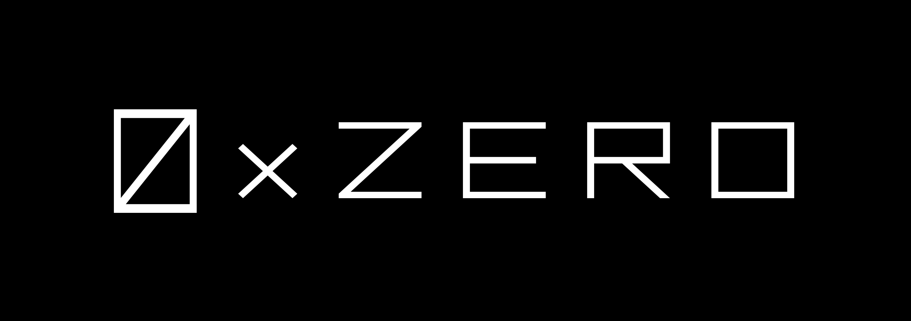

<br>
<p align="center">
  
</p>

<br>

<p align="center">
   <a href="https://github.com/0xZeroLabs/zero-mono/network/members"></a>
   
   <a href="https://x.com/0xZeroProtocol"></a>
   <br>
   
   <a href="https://github.com/0xZeroLabs/zero-mono/issues"></a>
   <a href="https://github.com/0xZeroLabs/zero-mono/pulls"></a>
   <a href="https://github.com/0xZeroLabs/zero-mono/graphs/contributors"></a>
   
<br>
  <a href="https://docs.0xzero.org"></a>
  <a href="https://github.com/0xZeroLabs/zero-mono/blob/master/LICENSE"></a>
<a href="https://www.npmjs.org/package/@0xzerolabs/sdk"></a>
</p>

# ZERO Protocol Mono

Welcome to the base of all of our code. Feel free to look around.

## What's inside?

A Turborepo which includes the following packages/apps:

### Apps and Packages

- `@0xzerolabs/ui`: a stub Vue component library shared by both the applications
- `@0xzerolabs/eslint-config`: `eslint` configurations (includes `eslint-config-next` and `eslint-config-prettier`)

Each package/app is 100% [TypeScript](https://www.typescriptlang.org/).

### Utilities

This Turborepo has some additional tools already setup:

- [TypeScript](https://www.typescriptlang.org/) for static type checking
- [ESLint](https://eslint.org/) for code linting
- [Prettier](https://prettier.io) for code formatting

### Build

To build all apps and packages, run the following command:

```
cd zero-mono
pnpm build
```

### Develop

To develop all apps and packages, run the following command:

```
cd zero-mono
pnpm dev
```

### Remote Caching

Turborepo can use a technique known as [Remote Caching](https://turbo.build/repo/docs/core-concepts/remote-caching) to share cache artifacts across machines, enabling you to share build caches with your team and CI/CD pipelines.

By default, Turborepo will cache locally. To enable Remote Caching you will need an account with Vercel. If you don't have an account you can [create one](https://vercel.com/signup), then enter the following commands:

```
cd zero-mono
npx turbo login
```

This will authenticate the Turborepo CLI with your [Vercel account](https://vercel.com/docs/concepts/personal-accounts/overview).

Next, you can link your Turborepo to your Remote Cache by running the following command from the root of your Turborepo:

```
npx turbo link
```

## Useful Links

Learn more about the power of Turborepo:

- [Tasks](https://turbo.build/repo/docs/core-concepts/monorepos/running-tasks)
- [Caching](https://turbo.build/repo/docs/core-concepts/caching)
- [Remote Caching](https://turbo.build/repo/docs/core-concepts/remote-caching)
- [Filtering](https://turbo.build/repo/docs/core-concepts/monorepos/filtering)
- [Configuration Options](https://turbo.build/repo/docs/reference/configuration)
- [CLI Usage](https://turbo.build/repo/docs/reference/command-line-reference)
