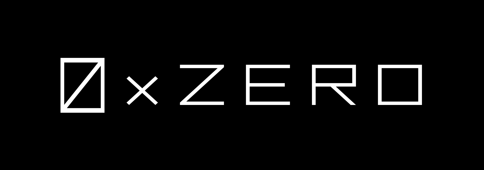

  

# OMID SDK

The OMID SDK is the utility package for the [OMID Wallet](https://protocol.0xzero.org/omid).

Check out our docs for [step-by-step instructions.](https://docs.0xzero.org/developers/omid-sdk)
